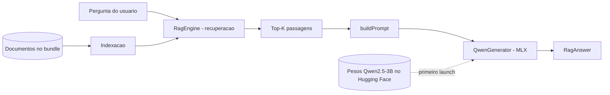

# TesteFoundation

Aplicativo iOS de demonstração de um pipeline **RAG (Retrieval-Augmented Generation)** totalmente on-device, com recuperação semântica via `NaturalLanguage` e geração de texto através de um modelo **Qwen2.5-3B** executado localmente pelo framework **MLX** da Apple.

Toda a inferência acontece no dispositivo: nenhum dado de pergunta ou de contexto é enviado para servidores externos. A única comunicação de rede é o download único dos pesos do modelo na primeira execução.

## Arquitetura



O fluxo é dividido em duas etapas independentes:

1. **Recuperação (Retrieval)** — `RagEngine` indexa os documentos e seleciona as passagens mais relevantes para a pergunta.
2. **Geração (Generation)** — `QwenGenerator` recebe o contexto recuperado + a pergunta e produz a resposta com o modelo de linguagem local.

## Camada de RAG (`RagEngine.swift`)

`RagEngine` é uma classe `@MainActor` e `@Observable`, responsável por toda a etapa de recuperação.

### 1. Ingestão e extração de texto

- Os documentos são lidos do bundle do app com `PDFKit` (`PDFDocument`).
- O texto é extraído página a página, normalizado (trim de espaços/linhas em branco) e concatenado.
- Documentos sem texto extraível disparam um erro tipado (`RagEngineError`).

### 2. Chunking

O texto é fatiado em passagens (`RagPassage`) com base em parágrafos, respeitando um limite de tamanho:

- `chunkSize = 750` caracteres por passagem (aproximado).
- Parágrafos muito curtos (< 40 caracteres) são descartados.
- Parágrafos são acumulados até atingir o limite, então um novo chunk é iniciado, preservando coesão semântica.

### 3. Embeddings e indexação

- Usa `NLEmbedding.sentenceEmbedding(for: .portuguese)` para gerar vetores densos de cada passagem.
- Caso o modelo de embedding não esteja disponível, o sistema faz *fallback* para `.undetermined` e, em último caso, para busca por palavra-chave.
- Cada passagem indexada (`IndexedPassage`) guarda o texto e seu vetor.

### 4. Recuperação (Top-K)

Há dois modos de busca, expostos por `RagRetrievalMode`:

- **Busca semântica (`embedding`)** — calcula **similaridade de cosseno** entre o vetor da pergunta e o de cada passagem.
- **Busca por palavra-chave (`keyword`)** — *fallback* baseado em sobreposição de termos tokenizados (lowercase, sem acentos, ignorando tokens de até 2 caracteres).

Em ambos os casos, as `topK = 4` passagens de maior pontuação são retornadas como `RagSource` (com título da fonte, trecho e score).

### 5. Montagem do prompt

`buildPrompt(question:sources:)` concatena as passagens recuperadas como contexto numerado e anexa a pergunta do usuário. Um *system prompt* fixo orienta o modelo a responder **apenas** com base no contexto fornecido e a admitir quando a informação não está presente, reduzindo alucinações.

## Camada de Geração com MLX (`QwenGenerator.swift`)

`QwenGenerator` é um singleton `@MainActor` que encapsula o carregamento e a execução do modelo local.

### Modelo

- **`mlx-community/Qwen2.5-3B-Instruct-4bit`** — Qwen2.5 de 3B de parâmetros, quantizado em 4 bits para caber e rodar de forma eficiente em dispositivos móveis.
- Carregado via `#huggingFaceLoadModelContainer`, que baixa os pesos do Hugging Face Hub na primeira execução e os mantém em cache local para execuções seguintes.

### Carregamento

- `loadModelIfNeeded(onProgress:)` carrega o `ModelContainer` de forma preguiçosa (apenas uma vez) e reporta o progresso de download via callback.
- `Memory.cacheLimit = 20 MB` limita o crescimento do cache de buffers da GPU para evitar pressão de memória durante a inferência.

### Inferência

- A geração usa a API `ChatSession` do `MLXLMCommon`, recebendo o *system prompt* como `instructions` e a pergunta + contexto como mensagem do usuário.
- Parâmetros de geração: `maxTokens = 512`, `temperature = 0.3` (respostas mais determinísticas e fiéis ao contexto).

### Restrições de plataforma

- **MLX exige GPU Metal e só roda em iPhone físico.** No Simulador, qualquer chamada lança `QwenGeneratorError.simulatorNotSupported` (guardado com `#if targetEnvironment(simulator)`), e a UI exibe uma mensagem explicativa.

## Máquina de estados e UI (`RagView.swift`)

A `RagView` (SwiftUI) reage ao estado publicado por `RagEngine` (`RagEngineState`):

| Estado | UI |
|--------|----|
| `idle` / `indexing` | Indicador de progresso ("Indexando…") |
| `loadingModel(progress:)` | Barra de progresso do download do modelo (%) |
| `ready(passageCount:mode:)` | Formulário de perguntas + metadados do índice |
| `answering` | Indicador de "gerando resposta" |
| `error(String)` | Mensagem de erro + ação de tentar novamente |

No Simulador, a view exibe diretamente um `ContentUnavailableView` informando que é necessário um dispositivo físico.

## Estrutura do projeto

```
TesteFoundation/
├── TesteFoundationApp.swift      # Entry point, TabView (SwiftData + RAG)
├── RagEngine.swift               # Recuperação: ingestão, chunking, embeddings, top-K
├── QwenGenerator.swift           # Geração: carregamento e inferência MLX/Qwen
├── RagView.swift                 # UI SwiftUI orientada a estados
├── ContentView.swift / Item.swift# Aba de exemplo (SwiftData) — não relacionada ao RAG
└── TesteFoundation.entitlements  # Increased Memory Limit
```

## Dependências (Swift Package Manager)

| Pacote | Produtos | Uso |
|--------|----------|-----|
| [`mlx-swift-lm`](https://github.com/ml-explore/mlx-swift-lm) | `MLXLLM`, `MLXLMCommon`, `MLXHuggingFace` | Carregamento e inferência de LLMs com MLX |
| [`swift-huggingface`](https://github.com/huggingface/swift-huggingface) | `HuggingFace` | Download dos pesos do Hugging Face Hub |
| [`swift-transformers`](https://github.com/huggingface/swift-transformers) | `Tokenizers` | Tokenização do modelo |

Frameworks de sistema utilizados: `PDFKit` (extração de texto), `NaturalLanguage` (embeddings), `SwiftUI`, `SwiftData`.

## Requisitos

- **Xcode 26+** e **iOS 26+** (deployment target do projeto).
- **iPhone físico com chip Apple Silicon e GPU Metal** — o Simulador não é suportado pelo MLX.
- Recomendado **8 GB de RAM** (ex.: iPhone 15 Pro / iPhone 16) para o modelo de 3B em 4 bits.
- Conexão de rede **apenas na primeira execução**, para baixar os pesos (~1.8 GB). Depois, funciona offline.
- Entitlement **Increased Memory Limit** (`com.apple.developer.kernel.increased-memory-limit`) habilitado para permitir o uso de memória além do limite padrão de *jetsam*.

## Como executar

1. Abra `TesteFoundation.xcodeproj` no Xcode.
2. Aguarde a resolução dos pacotes Swift.
3. Selecione um **iPhone físico** como destino e configure o *Signing Team*.
4. Ative o **Developer Mode** no dispositivo (Ajustes › Privacidade e Segurança › Modo de Desenvolvedor).
5. Compile e execute (`⌘R`). Na primeira execução, aguarde o download do modelo (acompanhado pela barra de progresso na aba RAG).
